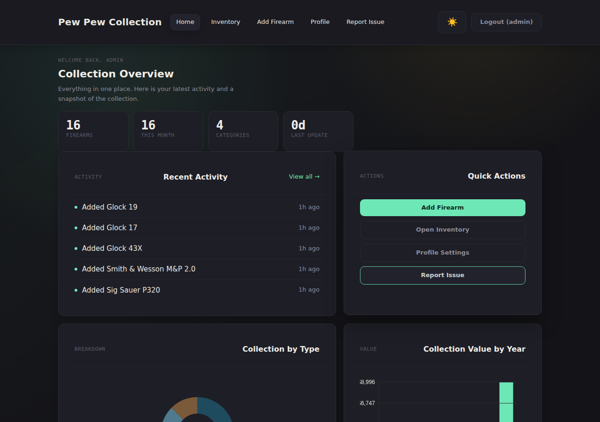
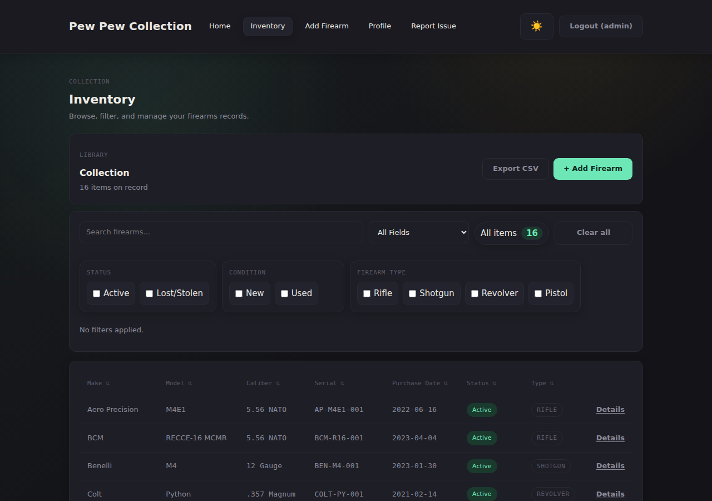
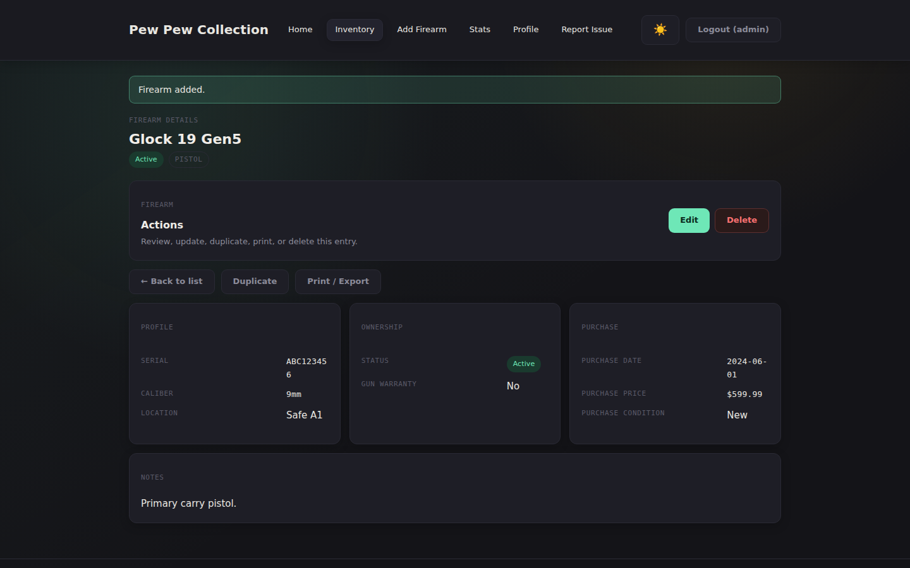
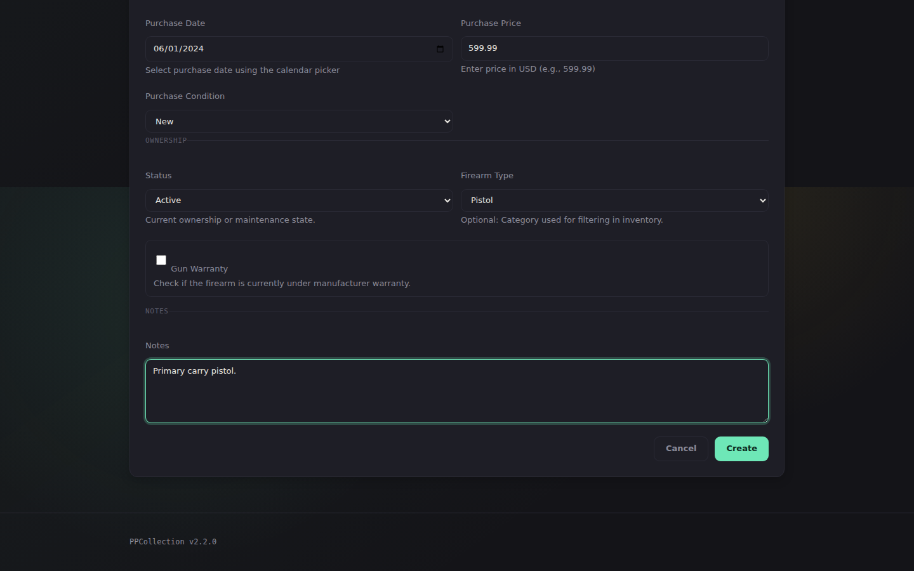
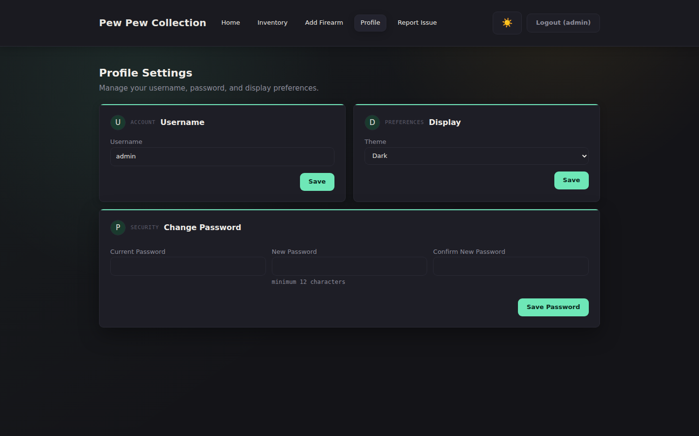

# Pew Pew Collection

Pew Pew Collection (PPCollection) is a self-hosted, offline-first firearm inventory app for tracking and managing a personal collection locally with no cloud dependency, built with Node.js/Express and SQLite.

[](https://github.com/Gogorichielab/PPCollection/actions/workflows/Release.yml)
[](https://github.com/Gogorichielab/PPCollection/actions/workflows/Ci.yml)

[](CONTRIBUTING.md)



## Features

- **Full inventory CRUD** — Add, edit, duplicate, and delete firearm records with make, model, serial, caliber, type, condition, status, location, purchase details, warranty, and notes
- **Disposition tracking** — Records sold/lost/stolen firearms with transferee name, address, date, and reason; disposition fields are included in CSV exports
- **Dashboard** — Collection overview with recent activity feed, type breakdown chart, and purchase-value-by-year chart
- **Reports & analytics** — Dedicated reporting page with collection summary, breakdown charts by type/caliber/make/condition, acquisition trends by month, average price by year, and disposition statistics
- **Search & filter** — Real-time search across all fields; filter by status, condition, and firearm type; sort by any column; the "All items" count badge updates live as filters are applied; inventory rows collapse into cards on mobile viewports
- **CSV export & import** — Download your entire inventory with one click, or bulk-import records from a CSV file (template provided)
- **Serial number uniqueness** — Database-enforced unique constraint on serial numbers prevents duplicate entries; validated during both form submission and CSV import
- **Bcrypt authentication** — Session-based login with bcrypt-hashed passwords and a forced password change on first login
- **Profile management** — Update username, change password, and toggle display preferences from the profile page
- **Dark & light mode** — Theme preference persists per user across sessions; the toggle button exposes an accessible `aria-label` announcing the destination state for screen readers
- **Keyboard & screen-reader accessible** — Skip-to-main navigation for keyboard users, and descriptive labels on interactive controls so screen readers announce the correct action
- **CSRF protection** — All forms protected via the double-submit cookie pattern
- **Fully offline** — Zero internet requirement at runtime; no telemetry, no external services
- **Optional update notifications** — Opt-in check against GitHub Releases (14-day cached); disabled by default
- **Single SQLite file** — All data in one portable file; backup with a single `cp` command
- **Docker ready** — Up and running in under 60 seconds from GHCR

## Quick Start (Docker)

```bash
docker run -d \
  --name ppcollection \
  -p 3000:3000 \
  -e SESSION_SECRET="$(openssl rand -hex 32)" \
  -e ADMIN_USERNAME=admin \
  -e ADMIN_PASSWORD=YourSecurePassword \
  -v ./data:/data \
  --restart unless-stopped \
  ghcr.io/gogorichielab/ppcollection:latest
```

Open `http://localhost:3000`. On first login you will be prompted to change the default password.

## Configuration

| Variable | Purpose | Default | Notes |
|---|---|---|---|
| `SESSION_SECRET` | Session signing secret | `ppcollection_dev_secret` | **Required in production.** Generate with `openssl rand -hex 32` |
| `ADMIN_USERNAME` | Username for the admin account | `admin` | Used for initial login |
| `ADMIN_PASSWORD` | Initial admin password | `changeme` | **Required in production for first-run.** A change is forced on first login. The app refuses to seed a fresh deployment with the documented default. |
| `PORT` | HTTP port the server listens on | `3000` | Runtime server port |
| `DATABASE_PATH` | Path to the SQLite database file | `/data/app.db` | Defaults to `/data` in Docker |
| `TRUST_PROXY` | Trust `X-Forwarded-Proto` from a reverse proxy | `false` | Set to `true` when running behind nginx, Caddy, or Traefik |
| `SECURE_COOKIES` | Set the `Secure` flag on session and CSRF cookies | `true` in production, `false` otherwise | When unset, defaults to `true` whenever `NODE_ENV=production` (the published Docker image always sets this). Set `SECURE_COOKIES=false` to opt out — required if you run the app on plain HTTP in production. Requires `TRUST_PROXY=true` when behind an HTTPS reverse proxy. |
| `UPDATE_CHECK` | Check GitHub Releases for new versions | `false` | Set to `true` to enable in-app update notifications; results are cached for 14 days |

## Security Notes

> **Reverse proxy users:** If you are running PPCollection behind
> nginx, Caddy, or Traefik with HTTPS, set `TRUST_PROXY=true`. Secure
> cookies are now on by default when `NODE_ENV=production` (which is
> always the case in the published Docker image), so you no longer
> need to set `SECURE_COOKIES=true` explicitly — but `TRUST_PROXY` is
> still required so Express recognizes the proxied request as HTTPS,
> otherwise sessions will silently fail to persist.

> **Plain-HTTP production deployments:** If you intentionally run the
> app on plain HTTP in production (no TLS terminator at all), the
> browser will refuse to set or send `Secure` cookies and sessions
> will break. Set `SECURE_COOKIES=false` to opt out and restore plain
> session cookies. This is also the upgrade path from earlier versions
> if you were running on plain HTTP without realizing it.

## Upgrading

Existing deployments continue to work without configuration changes.
The guards introduced in v2.x only affect **new installations** that
have never seeded an admin account. If you've been running the app,
your account hash is already stored in `app.db` and no action is
required.

**Secure cookies (v2.0.0+):** Session and CSRF cookies now have the
`Secure` flag enabled by default when `NODE_ENV=production` (the
published Docker image always sets this). Before v2.0.0 the flag was
opt-in.

| If you run the app... | What you need to do |
|---|---|
| Behind an HTTPS reverse proxy with `TRUST_PROXY=true` | Nothing. |
| Behind an HTTPS reverse proxy without `TRUST_PROXY` | Set `TRUST_PROXY=true` so Express honors the `X-Forwarded-Proto` header. |
| On plain HTTP in production (no TLS) | Add `SECURE_COOKIES=false` to restore plain cookies; otherwise sessions will silently fail. |
| Locally (any non-production `NODE_ENV`) | No change. Default is still off. |

**`SESSION_SECRET` is required in production (v2.0.1+):** The app
refuses to start if `SESSION_SECRET` is unset or matches the
hard-coded default. Generate one with `openssl rand -hex 32`.

**`ADMIN_PASSWORD` is required for first-run in production (v2.0.0+):**
The app refuses to start on a fresh install if `ADMIN_PASSWORD` is
unset or `changeme`. Set a strong value before the first start:

```bash
ADMIN_PASSWORD="$(openssl rand -base64 24)"
```

## Operations

- **Liveness probe:** `GET /health` returns `200 { status, version, uptime }` without
  requiring authentication and is excluded from the request log. Use it from a
  reverse proxy, Docker `HEALTHCHECK`, or external monitor.
- **Container health:** The published image declares `HEALTHCHECK` against
  `/health`. `docker inspect --format '{{.State.Health.Status}}' ppcollection`
  reports `healthy` when the HTTP server is serving requests.
- **Graceful shutdown:** The process traps `SIGTERM`/`SIGINT`, stops accepting
  new connections, drains in-flight requests, and closes the SQLite database
  before exiting. `docker compose` is configured with a 15s
  `stop_grace_period`.

## Screenshots

| Inventory | Firearm Detail |
|---|---|
|  |  |

| Add Firearm | Profile |
|---|---|
|  |  |

## Documentation

Full documentation: [https://gogorichielab.github.io/PPCollection/](https://gogorichielab.github.io/PPCollection/)

## Contributing

Contributing guide: [CONTRIBUTING.md](CONTRIBUTING.md)

PPCollection uses `.github/CODEOWNERS` to request maintainer review
automatically, especially for high-blast-radius areas such as GitHub Actions
configuration, Docker runtime files, release configuration, and database
migrations. Maintainers should enable branch protection on `main` that
requires Code Owner review before merge.

## License

Licensed under GNU GPL v3 or later: [LICENSE](LICENSE)
